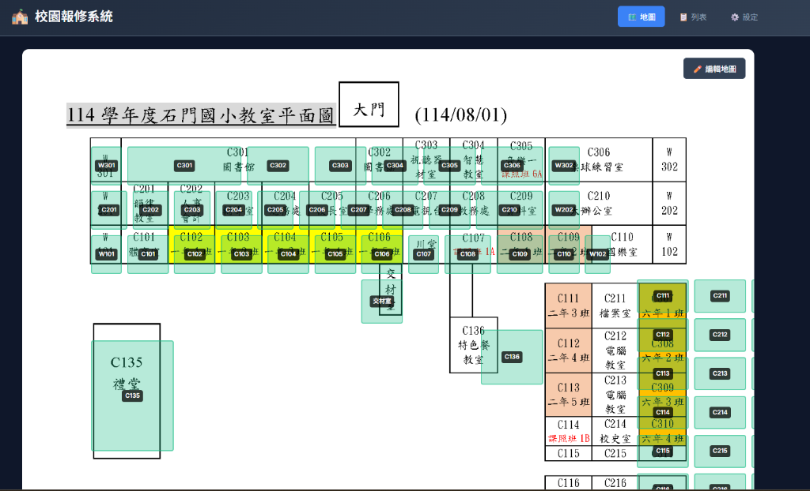

# 🗺️ 地圖校正功能使用說明

本系統提供「智慧兩點定位」功能，協助您快速將教室配置圖對齊到系統底圖。

## 🚀 快速上手步驟

### 第一步：啟動校正模式
1. 點擊畫面右上角的 **「校正位置」** 按鈕。
2. 進入校正模式後，地圖上方會出現提示卡片。

### 第二步：第一點定位 (基準點 - 左上角)
1. 依據提示，請在您的地圖圖片上找到 **「W301 (廁所)」**。
   *(通常位於地圖左上角)*
2. 點擊該教室的 **中心點**。
3. **✨ 即時回饋**：點擊後，系統地圖會立即移動到您點擊的位置。

### 第三步：第二點定位 (水平參考 - 最右側)
1. 依據提示，請在您的地圖圖片上找到 **「C310 (六年4班)」** 或 **「最右側的教室」**。
   *(系統會提示建議的教室名稱)*
2. 點擊該教室的 **中心點**。
3. **✨ 水平校正**：系統將根據此點調整地圖的寬度比例。

### 第四步：第三點定位 (垂直參考 - 最下方)
1. 依據提示，請在您的地圖圖片上找到 **「C126 (廚房)」** 或 **「最下方的教室」**。
   *(系統會提示建議的教室名稱)*
2. 點擊該教室的 **中心點**。
3. **✨ 垂直校正**：系統將根據此點調整地圖的高度比例。

### 第五步：微調與存檔
如果自動校正後還有微小誤差，您可以使用以下方式進行微調：

*   **滑鼠拖曳**：拖動右側面板的滑桿 (水平位移/垂直位移/縮放)。
*   **⌨️ 鍵盤微調 (推薦)**：
    *   **方向鍵 (↑↓←→)**：微調地圖位置。
    *   **Ctrl + 方向鍵**：微調地圖縮放 (變大/變小)。
    *   **Shift + 方向鍵**：加快移動速度。

確認無誤後，點擊頂部的 **「套用校正」** 按鈕即可完成！

### ✅ 校正成功範例

---

## 💡 常見問題

**Q: 我的地圖上沒有 C126 廚房怎麼辦？**
A: 系統會自動尋找替代點 (如側門或最後一間教室)。請仔細閱讀畫面上的提示文字，依據提示點擊對應的教室即可。

**Q: 校正預覽看起來怪怪的，但套用後是正常的？**
A: 這是導致顯示不同步的問題，我們已在最新版本中修復。若您仍遇到此問題，請嘗試重新整理頁面。目前的預覽畫面應與最終結果一致。
